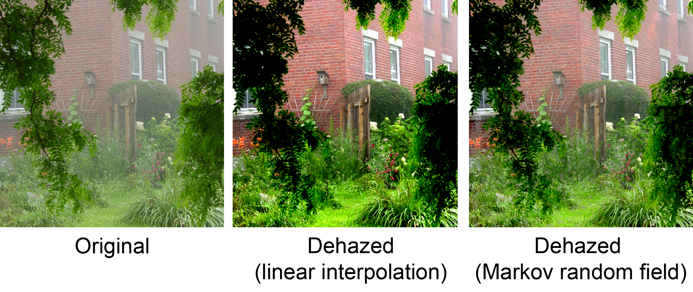

## Dehazing using Color-lines
This repository contains an open-source implementation of [Fattal's algorithm for dehazing](https://www.cse.huji.ac.il/~raananf/projects/dehaze_cl/). 
It is meant as an accessible implementation with low complexity and ample documentation that can be used as an aid for studying the algorithm.   

Dehazing a single image with linear interpolation takes around **10 seconds** on a modern CPU (previously 60 seconds). This is achieved by using [Numba](http://numba.pydata.org/) in the main loop. Speed is improved even further by Numba when dehazing multiple images successively.
  
For other implementations, see those by [Ekesium](https://github.com/ekexium/dehazing-using-color-lines) and [Tomlk](https://github.com/Tomlk/Dehazing-with-Color-Lines) (also pixel-wise inference, but in scala and C++).

## How to Use 
Use a venv and install the required packages by running `pip install -r requirements.txt`.    
Execute `python dehaze.py` to dehaze `images/bricks.png`. 

## Example output

.

To find other images with a given airlight vector, see the paper's [result page](https://www.cse.huji.ac.il/~raananf/projects/dehaze_cl/results/).

## File structure 
| Name                    | Purpose                                                                           |
|-------------------------|-----------------------------------------------------------------------------------|
| dehaze.py               | Main function                                                                     |
| ransac.py               | RANSAC algorithm for evaluating color-line hypotheses                             |
| window.py               | A windowing class for concise tiling                                              |
| color_line.py           | Functions for evaluating color-line validity                                      |
| constants.py            | All constants and thresholds (comments note where values deviate from Fattal)        |
| linear_interpolation.py | Linear interpolation of the transmission image                                    |
| markov_random_field.py  | Markov random field interpolation and smoothing functions (autograd optimization) |
| recover.py              | Recovers the dehazed pixel values given the estimated transmission map            |
| numba_patch.py          | Patches the Numba's `jitclass`, as it currently does not support the numpy error model |

## TODO 
* Implement [automatic airlight recovery paper](https://www.cse.huji.ac.il/~raananf/projects/atm_light/)
